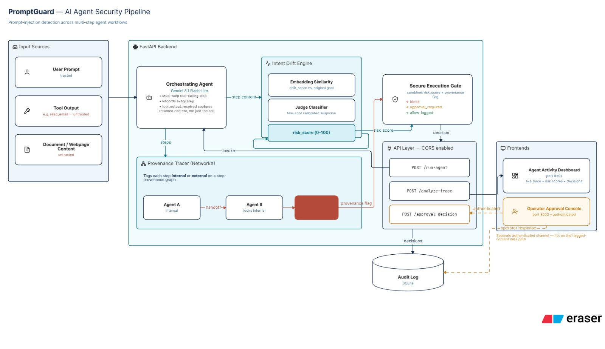

# PromptGuard

## Problem

AI agents that call tools and take multi-step actions are vulnerable to prompt injection: malicious instructions hidden inside an email, document, or chat message an agent reads can hijack its behavior mid-task. Most existing safeguards only screen the first prompt a user gives an agent — they don't watch what the agent does as it acts on content it encounters along the way, and they don't account for one agent handing work off to another.

## The Gaps We're Solving

PromptGuard targets two specific blind spots in current agent security:

1. **Intent Drift Detection** — checks whether each action an agent takes still lines up with the goal it was originally given, not just whether the first prompt looked safe. It blends semantic similarity (does this step's content still look like the original goal?) with a judge-model call (does the text that triggered this step read like an injected instruction?) into a single risk score per step.
2. **Cross-Agent Provenance Tracing** — tracks whether content is internally trusted or externally sourced, and makes sure that tag survives even when content is handed from one agent to another. This catches the "confused deputy" case: a compromised Agent A can't launder poisoned content into a handoff that looks trustworthy to Agent B — the receiving agent's step gets flagged `tainted`, even though on its face it looks like an ordinary internal handoff.

## Architecture

A FastAPI backend exposes five endpoints:
- `POST /run-agent` — drives a mock tool-calling agent (Gemini function calling) against a stated goal, producing a step-by-step trace of everything it did.
- `POST /analyze-trace` — runs any trace (agent-generated or hand-built) through the detection pipeline and returns a per-step risk assessment. Persists both the trace itself and its detection results, so either can be looked up again later.
- `GET /trace/{trace_id}` — looks up a previously-analyzed trace by ID and returns it alongside its detection results, so a client (like the Agent Activity Dashboard) can display one specific real trace instead of resending a fixed payload. 404 if that trace_id was never analyzed.
- `GET /pending-approvals` — returns every detection currently flagged for review that hasn't been approved or denied yet, so the approval dashboard can poll for real work instead of using hardcoded data.
- `POST /approval-decision` — records a human reviewer's approve/deny call on a step the pipeline flagged for review. Persisted to SQLite and validated against the original flagged record, so a decision can't be spoofed by tampering with the flagged content itself, and rejected if that step was already decided.

Each step in a trace passes through three independently-testable components, wired together by `main.py`:
- **Intent Drift Engine** — embeds the step's content and compares it against the original goal, and separately asks a judge model whether the text driving that step looks like an injected instruction. The two signals combine into a 0–100 risk score.
- **Provenance Tracer** — builds a directed graph of the trace's steps and tags each one `internal`, `external`, or `tainted`, propagating external taint across agent-to-agent handoffs.
- **Secure Execution Gate** — pure decision logic turning a risk score and provenance flag into `allow_logged`, `approval_required`, or `block` — with a hard floor: anything `tainted` is never auto-allowed, no matter how low its score.



A Streamlit frontend (separate codebase, in `frontend/`) calls this API: an **Agent Activity Dashboard** (`app.py`, port 8501) visualizes a trace step-by-step alongside its detection results — either a fixed demo example, or a real, previously-analyzed trace looked up live by ID via `GET /trace/{trace_id}` — and an **Operator Approval Console** (`approval_dashboard.py`, port 8502) polls `/pending-approvals` and lets an authenticated reviewer approve or deny flagged steps via `/approval-decision`, attributing each decision to the operator ID they enter. Both are live and working.

## Tech Stack

- Python 3.11+, FastAPI
- Google Gemini API (`google-genai` SDK) for the agent's function calling, the injection judge, and embeddings — currently `gemini-3.1-flash-lite` for both the agent and judge models, `gemini-embedding-2` for embeddings. These are pinned in `backend/app/config.py` by calling Gemini's `models.list()` live rather than hardcoded from documentation, since the free tier's available models — and their daily quotas — shift often enough that a remembered name can go stale within hours.
- NetworkX for the in-memory provenance graph; SQLite for persisting traces, detection outputs, and approval decisions
- pytest for testing

## How to Run

**Backend:**
```bash
cd backend
pip install -r requirements.txt
# copy .env.example to .env and set GEMINI_API_KEY
uvicorn app.main:app --reload
```

**Frontend** (separate terminal):
```bash
cd frontend
pip install -r requirements.txt
streamlit run app.py
streamlit run approval_dashboard.py --server.port 8502
```
`app.py` runs on Streamlit's default port (8501); `approval_dashboard.py` is explicitly pinned to 8502 so both can run side by side. Both read their settings from `frontend/config.py` — in particular `BACKEND_URL` (which host/port to call), overridable via a `BACKEND_URL` environment variable if the backend isn't at the default address (e.g. when the two run on different machines and the backend's LAN IP has changed).

## Team

- Backend / detection engine
- Frontend / approval UI
- Test validation
- Docs / submission
